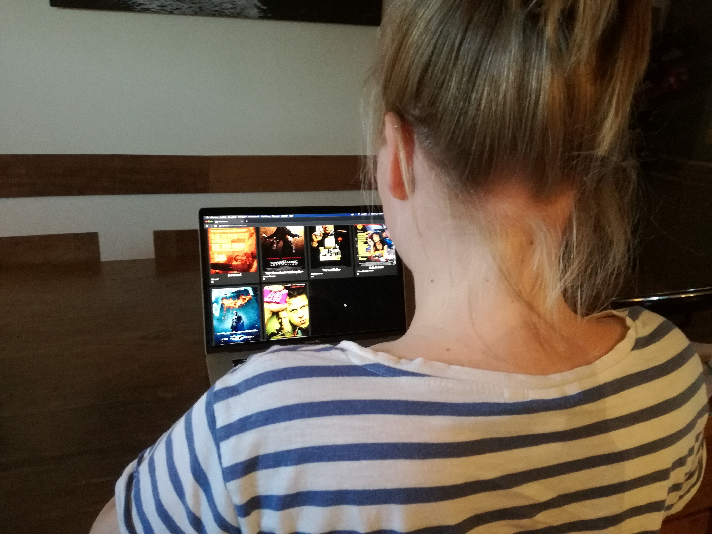

# frontend voor designers - opdracht 3

## Zoek een film die bij je past

Voor opdracht 3 heb ik een site gemaakt met een lijst aan films. Hier kun je zoeken naar een film als je niet welke film je die avond wilt zien.

Als je de muis boven een film houdt begint de trailer af te spelen. Als je muis weghaalt pauzeert de trailer. Als je je muis weer boven dezelfde film houd begint de trailer af te spelen op het punt waar je was gebleven. Klik op de trailer om de trailer in fullscreen te zien.

## Links naar demo's
[Versie 1](https://kazbison.github.io/frontendvoordesigners/opdracht3/v1/)

[Versie 2](https://kazbison.github.io/frontendvoordesigners/opdracht3/v1/)

[Eindresultaat](https://kazbison.github.io/frontendvoordesigners/opdracht3/v3/)

## opdracht 3 usability test

Uit de test ben ik er achter gekomen dat de site goed werkt. Het enige punt was dat de beschrijving miste. Ze liet weten vaak de beschrijving te lezen en maar een kort deel van de trailer te kijken. Als je de hele trailer hebt gezien heb je al een groot deel van de interessante scènes gezien.

### Conclusie uit de test

Beschrijving van de film toevoegen.

Daarnaast heb ik ook in plaats van alle acteurs te tonen ervoor gekozen alleen de eerste drie acteurs te tonen. De eerst genoemde acteurs zijn altijd de bekendste acteurs. En ik heb de balk met genres uit de header verwijderd, omdat het me niet gelukt was een filter te maken in mijn javascript.

